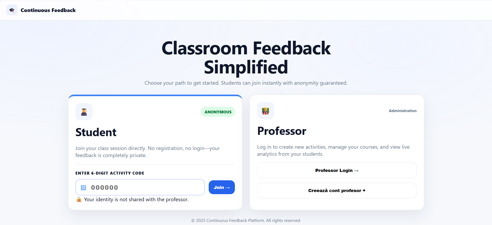
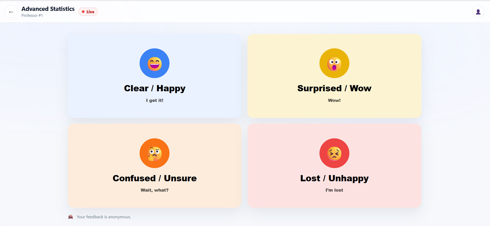
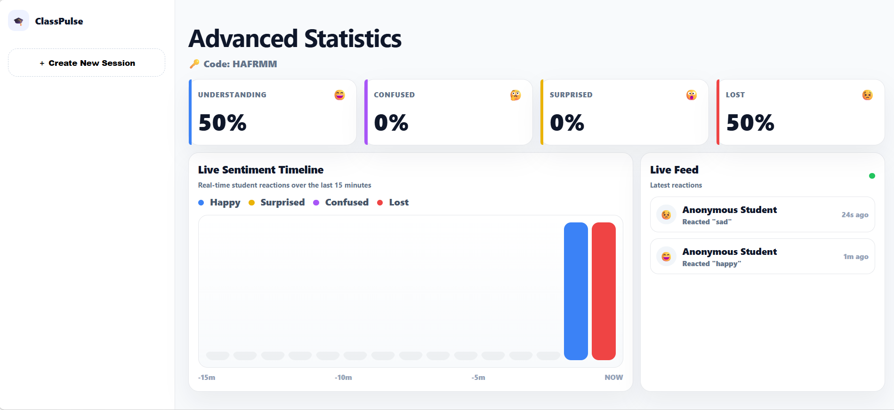

# Continuous Feedback WebApp

A full-stack web application for collecting real-time, anonymous student feedback during courses and seminars.

Students provide quick feedback using emoji-based reactions, while teachers gain actionable insights through real-time dashboards and aggregated analytics.

Developed as a team project within a university course.

---

## Demo

### Landing page


### Student Feedback


### Activity Dashboard


---

## Overview

The application enables:
- **Real-time feedback collection** from students
- **Anonymous reactions** to lectures and seminars
- **Dashboard views** for teachers to monitor engagement and sentiment
- Clear separation between frontend, backend, and documentation

---

## Highlights

- Real-time feedback system using emoji reactions  
- Anonymous data collection  
- Teacher dashboards with aggregated insights  
- Full-stack architecture (React + Node.js + DB)  
- Dockerized development environment  

## Project Structure

```text
continuous-feedback-app/
├── docs/ # Documentation, specifications, test plans
├── frontend/ # React.js frontend application
├── backend/ # Node.js REST API
└── README.md
```

---

## 🛠️ Tech Stack

### Frontend
- **React.js** (Single Page Application)
- Component-based architecture
- Client-side routing and services layer

### Backend
- **Node.js**
- **REST API**
- Authentication middleware
- Relational database access (MySQL / PostgreSQL)

### Other
- **Docker & Docker Compose** (local development)
- **OpenAPI / Swagger** specification
- **Jest + Supertest** (API testing)
- **Git / GitHub** for version control

---

## Features

- Emoji-based feedback collection
- Role-based access (students / teachers)
- Anonymous feedback storage
- Teacher dashboards for activity and feedback visualization
- RESTful API with documented endpoints

---

## Setup & Development

### Quick setup (development)

1. Configure environment variables

```bash
cp .env.example .env
```
#### Backend

```bash
cd backend
npm install
npm start
```

#### Frontend

```bash
cd frontend
npm install
npm start
```

Backend will be available at:
http://localhost:3000

## Documentation & Useful Files
- `docs/openapi.yaml` – OpenAPI / Swagger specification  
- `docs/TEST_PLAN.md` – Manual and automated testing  
- `docs/CURL_EXAMPLES.md` – cURL examples for API testing  
- `backend/tests/api.test.js` – API tests (Jest + Supertest)  
- `backend/Dockerfile` – Backend container configuration  

## Team

Ana-Miruna Grigore

Mara-Catinca Marinescu

Coordinating professor: Cimpeanu Ion Alexandru

## Notes
This project was developed as part of a university course and focuses on learning full-stack web development, teamwork, and clean project structure.

It is intended for educational and portfolio purposes.
